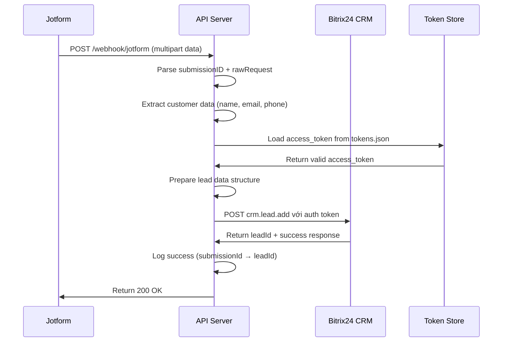

# 🚀 Jotform-Bitrix24 Integration API

**Ứng dụng API Node.js tích hợp tự động giữa Jotform và Bitrix24 CRM với hệ thống OAuth2 hoàn chỉnh.**

Khi có submission mới từ Jotform, hệ thống sẽ tự động tạo lead trong Bitrix24 CRM thông qua các phương thức xác thực OAuth2 an toàn.

## 🌟 Tính năng chính

- ✅ **Multiple OAuth2 Authentication Methods**: Hỗ trợ 3 phương thức xác thực
  - 🔧 **Installation Method**: Tự động từ Bitrix24 app installation
  - 🔐 **Legacy OAuth**: OAuth flow truyền thống  
  - 🎯 **Complete OAuth 2.0 Protocol**: Chuẩn OAuth2 đầy đủ
- ✅ **Webhook Processing**: Xử lý webhook Jotform với multipart data
- ✅ **Automatic Lead Creation**: Tự động tạo lead trong Bitrix24 CRM
- ✅ **Token Persistence**: Lưu trữ và quản lý tokens tự động
- ✅ **Auto Token Refresh**: Tự động gia hạn access token
- ✅ **Comprehensive Logging**: Logging chi tiết với Winston
- ✅ **Real-time Status**: Health check và API status endpoints
- ✅ **Error Handling**: Xử lý lỗi và validation hoàn chỉnh
- ✅ **Security Features**: CORS, rate limiting, input validation

## 🚀 Quick Start Guide

### ⚡ Cài đặt nhanh (5 phút)

1. **Clone và cài đặt:**
```bash
git clone https://github.com/tuanhuy22711/jotform-bitrix24-integration.git
cd jotform-bitrix24-integration
npm install
```

2. **Cấu hình Bitrix24 OAuth:**
```bash
cp .env.example .env
# Chỉnh sửa file .env với thông tin Bitrix24 của bạn
```

3. **Khởi động server:**
```bash
npm start
```

4. **Xác thực với Bitrix24 (chọn 1 trong 3 cách):**

#### 🎯 **Cách 1: Complete OAuth2 (Khuyến nghị)**
```bash
# Mở browser và truy cập:
http://localhost:3000/oauth2/start?domain=yourcompany.bitrix24.com
# Click "Authorize" trên Bitrix24
# Token sẽ được lưu tự động
```

#### 🔧 **Cách 2: App Installation (Tự động)**
```bash
# Setup app trong Bitrix24 với Installation URL:
http://localhost:3000/?DOMAIN=yourcompany.bitrix24.vn&PROTOCOL=1&LANG=vn
# Token sẽ được lưu tự động khi install
```

#### 🔐 **Cách 3: Legacy OAuth**
```bash
# Truy cập:
http://localhost:3000/oauth/authorize
# Hoàn thành OAuth flow
```

5. **Cấu hình Jotform Webhook:**
```bash
# Trong Jotform Settings > Integrations > Webhooks:
# Webhook URL: http://your-server.com/webhook/jotform
# Trigger: Complete Submission
```

### ✅ Kiểm tra hoạt động
```bash
# Kiểm tra server status
curl http://localhost:3000/health

# Kiểm tra token status  
curl http://localhost:3000/api/status

# Test connection Bitrix24
curl http://localhost:3000/api/test-token

# Test webhook
curl -X POST http://localhost:3000/webhook/test
```

## 📋 Yêu cầu hệ thống

- **Node.js**: 16+ (Khuyến nghị 18+)
- **npm/yarn**: Latest version
- **Bitrix24 Account**: Với quyền tạo OAuth applications
- **Jotform Account**: Với quyền webhooks
- **Server**: Có thể access public (cho webhook) hoặc ngrok
## ⚙️ Cấu hình chi tiết

### 1. File `.env` Configuration

```env
# 🌐 Server Configuration
NODE_ENV=development
PORT=3000

# 🔐 Bitrix24 OAuth2 Configuration
BITRIX24_CLIENT_ID=your_app_client_id
BITRIX24_CLIENT_SECRET=your_app_client_secret
BITRIX24_DOMAIN=yourcompany.bitrix24.com
BITRIX24_REDIRECT_URI=http://localhost:3000/oauth/callback

# ⏱️ API Configuration  
BITRIX24_TIMEOUT=10000

# 📝 Logging Configuration
LOG_LEVEL=info
LOG_FILE=logs/app.log

# 🛡️ Security (Optional)
RATE_LIMIT_WINDOW=15
RATE_LIMIT_MAX=100
```

### 2. Bitrix24 OAuth App Setup

#### Bước 1: Tạo OAuth Application
1. Đăng nhập vào Bitrix24
2. Vào **Applications** > **Developer resources** > **Other**
3. Click **"Register a new application"**

#### Bước 2: Cấu hình Application
```
Application Name: Jotform Integration
Application Code: jotform_integration
Application URL: http://localhost:3000
Callback URL: http://localhost:3000/oauth/callback
Permissions: 
  ✅ crm (CRM access)
  ✅ user (User information)
```

#### Bước 3: Lấy Credentials
```
Client ID: Copy vào BITRIX24_CLIENT_ID
Client Secret: Copy vào BITRIX24_CLIENT_SECRET
```

### 3. Jotform Webhook Setup

#### Bước 1: Vào Form Settings
1. Mở Jotform form cần tích hợp
2. Vào **Settings** > **Integrations**
3. Tìm và click **"Webhooks"**

#### Bước 2: Add Webhook
```
Webhook URL: http://your-server.com/webhook/jotform
Request Type: POST
When to Send: Complete Submission
```

#### Bước 3: Test Webhook
```bash
# Test endpoint (development only)
curl -X POST http://localhost:3000/webhook/test
```

## 🔗 API Endpoints

### 🏠 Installation & Root
- `GET /` - Installation endpoint cho Bitrix24 app
- `POST /` - Process installation từ Bitrix24

### 🔐 OAuth Authentication
- `GET /oauth/authorize` - Legacy OAuth authorization
- `GET /oauth/callback` - OAuth callback handler
- `GET /oauth/status` - OAuth authentication status

### 🎯 Complete OAuth2 Flow
- `GET /oauth2/start` - Start Complete OAuth2 flow
- `POST /oauth2/domain` - Submit domain for OAuth2
- `GET /oauth2/callback` - OAuth2 callback handler  
- `GET /oauth2/status` - OAuth2 authentication status

### 🪝 Webhook Endpoints
- `POST /webhook/jotform` - **Main webhook** - Xử lý submission từ Jotform
- `POST /webhook/test` - Test webhook (development only)

### ❤️ Health & Status
- `GET /health` - Health check tổng quan
- `GET /ping` - Simple ping endpoint

### 🔧 API Management
- `GET /api/status` - **Token status** - Kiểm tra access token hiện tại
- `GET /api/test-token` - Test token với Bitrix24
- `GET /api/info` - API information và endpoints
- `GET /api/contacts` - Lấy danh sách contacts từ Bitrix24
- `POST /api/bitrix24` - Direct Bitrix24 API proxy

## 🔄 OAuth2 Authentication Flow

Hệ thống hỗ trợ **3 phương thức xác thực OAuth2**:

### 1. 🎯 Complete OAuth 2.0 Protocol (Khuyến nghị)

**Sử dụng khi**: Muốn control flow hoàn toàn

```bash
# Step 1: Start OAuth2 flow
GET /oauth2/start?domain=yourcompany.bitrix24.com

# Step 2: User được redirect đến Bitrix24 authorize
# Step 3: User click "Authorize" 
# Step 4: Bitrix24 redirect về /oauth2/callback
# Step 5: System exchange code → access_token
# Step 6: Token saved to tokens.json
```

**Luồng chi tiết**:
```
User → /oauth2/start 
     → Bitrix24 Authorization Page
     → User Authorize  
     → /oauth2/callback?code=xxx
     → exchangeCodeForToken()
     → Save to tokens.json
     → Ready for webhooks ✅
```

### 2. 🔧 Installation Method (Tự động)

**Sử dụng khi**: Setup Bitrix24 app lần đầu

```bash
# Bitrix24 tự động POST đến:
POST /?DOMAIN=yourcompany.bitrix24.vn&PROTOCOL=1&LANG=vn&APP_SID=xxx

# System nhận AUTH_ID và REFRESH_ID trực tiếp
# Token saved tự động, không cần user action
```

**Luồng chi tiết**:
```
Bitrix24 App Install → POST / với AUTH_ID
                    → processInstallationAuth()
                    → Save to tokens.json  
                    → Ready for webhooks ✅
```

### 3. 🔐 Legacy OAuth (Đơn giản)

**Sử dụng khi**: Cần OAuth flow cơ bản

```bash
# User truy cập:
GET /oauth/authorize

# Tương tự Complete OAuth2 nhưng đơn giản hơn
```

## 🚀 Webhook Processing Flow

### Luồng xử lý Jotform → Bitrix24



### Chi tiết processing

#### 1. 📨 Webhook Reception
```javascript
// Jotform gửi POST với multipart/form-data
{
  "submissionID": "6312306247217209963",
  "rawRequest": "{\"form_id\":\"231234567890\",\"answers\":{...}}"
}
```

#### 2. 🔍 Data Parsing  
```javascript
// Extract thông tin khách hàng
const customerData = {
  name: rawRequest.answers['3']?.answer || 'N/A',
  email: rawRequest.answers['4']?.answer || 'N/A', 
  phone: rawRequest.answers['5']?.answer || 'N/A',
  message: rawRequest.answers['6']?.answer || 'N/A'
};
```

#### 3. 🔐 Token Validation
```javascript
// Load token từ tokens.json
const tokens = tokenStore.loadTokens();
if (!tokens.accessToken) {
  throw new Error('No access token available');
}
```

#### 4. 🎯 Lead Creation
```javascript
// Gọi Bitrix24 API
const leadData = {
  TITLE: `Jotform Lead: ${customerData.name}`,
  NAME: customerData.name,
  EMAIL: [{ VALUE: customerData.email, VALUE_TYPE: 'WORK' }],
  PHONE: [{ VALUE: customerData.phone, VALUE_TYPE: 'WORK' }],
  COMMENTS: customerData.message,
  SOURCE_ID: 'WEB'
};

const result = await bitrix24Service.makeApiCall('crm.lead.add', {
  fields: leadData
});
```

#### 5. ✅ Success Response
```json
{
  "success": true,
  "submissionId": "6312306247217209963",
  "leadId": 7,
  "duration": 1477,
  "method": "OAuth2"
}
```

## �️ Token Management

### Token Storage
Tokens được lưu trong `data/tokens.json`:

```json
{
  "accessToken": "60a0a168007b4179...",
  "refreshToken": "501fc968007b4179...", 
  "expiresIn": "3600",
  "domain": "b24-7woulk.bitrix24.vn",
  "memberId": "78d52900632fa1e9...",
  "status": "L",
  "clientEndpoint": "https://b24-7woulk.bitrix24.vn/rest/",
  "serverEndpoint": "https://oauth.bitrix.info/rest/",
  "savedAt": "2025-08-17T08:26:56.885Z",
  "expiresAt": "2025-08-17T09:26:56.885Z"
}
```

### Auto Token Refresh
```javascript
// Tự động refresh khi token hết hạn
if (result.error === 'expired_token') {
  const refreshResult = await oauth.refreshAccessToken();
  if (refreshResult.success) {
    // Retry API call với token mới
    return this.makeApiCall(method, params);
  }
}
```

### Token Status Check
```bash
# Kiểm tra token hiện tại
curl http://localhost:3000/api/status

# Response
{
  "hasToken": true,
  "domain": "b24-7woulk.bitrix24.vn", 
  "expiresAt": "2025-08-17T09:26:56.885Z",
  "isExpired": false,
  "timeRemaining": "45 minutes"
}
```

## 📊 Logging & Monitoring

### Log Structure
```json
{
  "timestamp": "2025-08-17T12:03:45.000Z",
  "level": "info", 
  "message": "Lead created successfully in Bitrix24",
  "meta": {
    "leadId": 7,
    "submissionId": "6312306247217209963", 
    "method": "OAuth2",
    "duration": 1462
  }
}
```

### Log Files
- `logs/app.log` - Tất cả activities
- `logs/error.log` - Chỉ errors và warnings
- Console output - Real-time trong development

### Key Log Messages
```bash
🎯 STARTING COMPLETE OAUTH2 FLOW      # OAuth2 bắt đầu
💾 TOKENS SAVED TO FILE              # Token lưu thành công
🔄 Making Bitrix24 API call          # Gọi API Bitrix24
✅ Lead created successfully         # Lead tạo thành công
❌ No access token available         # Cần authorize
🔄 Access token expired, refreshing  # Auto refresh token
```

### Monitoring Endpoints
```bash
# Overall health
GET /health
{
  "status": "healthy",
  "timestamp": "2025-08-17T12:03:45.000Z", 
  "services": {
    "oauth": { "status": "authenticated" },
    "storage": { "status": "ready" },
    "api": { "status": "operational" }
  }
}

# Token status  
GET /api/status
{
  "hasToken": true,
  "domain": "b24-7woulk.bitrix24.vn",
  "isExpired": false,
  "method": "Installation"
}

# Test connection
GET /api/test-token  
{
  "success": true,
  "message": "Connection successful",
  "user": {
    "ID": "1",
    "NAME": "John",
    "LAST_NAME": "Doe"
  }
}
```

## 🛡️ Security Features

- **Helmet.js**: Security headers
- **CORS**: Cross-origin resource sharing
- **Rate limiting**: Giới hạn requests per IP
- **Request size limiting**: Giới hạn kích thước request body
- **Input validation**: Validate webhook payloads

## 🔧 Configuration Options

### Environment Variables

| Variable | Description | Required | Default | Example |
|----------|-------------|----------|---------|---------|
| `NODE_ENV` | Environment mode | No | development | production |
| `PORT` | Server port | No | 3000 | 8080 |
| `BITRIX24_CLIENT_ID` | OAuth2 Client ID | **Yes** | - | `local.xxx.123` |
| `BITRIX24_CLIENT_SECRET` | OAuth2 Client Secret | **Yes** | - | `abc123...` |
| `BITRIX24_DOMAIN` | Default Bitrix24 domain | No | - | `company.bitrix24.com` |
| `BITRIX24_REDIRECT_URI` | OAuth callback URL | **Yes** | - | `http://localhost:3000/oauth/callback` |
| `BITRIX24_TIMEOUT` | API timeout (ms) | No | 10000 | 15000 |
| `LOG_LEVEL` | Logging level | No | info | debug |
| `LOG_FILE` | Log file path | No | logs/app.log | /var/log/app.log |

### Jotform Field Mapping

Tự động mapping fields từ Jotform sang Bitrix24:

```javascript
// Jotform submission structure  
{
  "form_id": "231234567890",
  "answers": {
    "3": { "answer": "Trần Huy" },        // Full Name
    "4": { "answer": "huy@email.com" },   // Email  
    "5": { "answer": "0978281697" },      // Phone
    "6": { "answer": "Need consultation" } // Message
  }
}

// Bitrix24 lead structure
{
  "TITLE": "Jotform Lead: Trần Huy",
  "NAME": "Trần Huy",
  "EMAIL": [{ "VALUE": "huy@email.com", "VALUE_TYPE": "WORK" }],
  "PHONE": [{ "VALUE": "0978281697", "VALUE_TYPE": "WORK" }], 
  "COMMENTS": "Need consultation",
  "SOURCE_ID": "WEB",
  "ASSIGNED_BY_ID": 1
}
```

### Custom Field Mapping
Để custom field mapping, chỉnh sửa trong `src/services/bitrix24Service.js`:

```javascript
// Custom mapping cho form khác
const fieldMapping = {
  name: 'answers.3.answer',      // Question 3 = Name
  email: 'answers.4.answer',     // Question 4 = Email  
  phone: 'answers.5.answer',     // Question 5 = Phone
  message: 'answers.6.answer'    // Question 6 = Message
};
```

## 🚀 Deployment Guide

### Local Development
```bash
# Clone repository
git clone https://github.com/tuanhuy22711/jotform-bitrix24-integration.git
cd jotform-bitrix24-integration

# Install dependencies
npm install

# Setup environment
cp .env.example .env
# Edit .env với credentials của bạn

# Start development server
npm run dev
# hoặc
npm start
```

### Production Deployment

#### 1. PM2 Process Manager (Khuyến nghị)
```bash
# Install PM2 globally
npm install -g pm2

# Create ecosystem config
cat > ecosystem.config.js << EOF
module.exports = {
  apps: [{
    name: 'jotform-bitrix24-api',
    script: './src/index.js',
    instances: 'max',
    exec_mode: 'cluster', 
    env: {
      NODE_ENV: 'production',
      PORT: 3000
    },
    error_file: './logs/pm2-error.log',
    out_file: './logs/pm2-out.log',
    log_file: './logs/pm2-combined.log'
  }]
}
EOF

# Deploy
pm2 start ecosystem.config.js
pm2 save
pm2 startup
```

#### 2. Docker Deployment
```dockerfile
# Dockerfile
FROM node:18-alpine

WORKDIR /app

# Copy package files
COPY package*.json ./
RUN npm ci --only=production

# Copy source code  
COPY . .

# Create logs directory
RUN mkdir -p logs data

# Expose port
EXPOSE 3000

# Health check
HEALTHCHECK --interval=30s --timeout=3s --start-period=5s --retries=3 \
  CMD curl -f http://localhost:3000/health || exit 1

# Start application
CMD ["npm", "start"]
```

```bash
# Build and run
docker build -t jotform-bitrix24-api .
docker run -d \
  --name jotform-api \
  -p 3000:3000 \
  -e NODE_ENV=production \
  -e BITRIX24_CLIENT_ID=your_client_id \
  -e BITRIX24_CLIENT_SECRET=your_secret \
  -v $(pwd)/data:/app/data \
  -v $(pwd)/logs:/app/logs \
  jotform-bitrix24-api
```

#### 3. Docker Compose
```yaml
# docker-compose.yml
version: '3.8'

services:
  jotform-api:
    build: .
    ports:
      - "3000:3000"
    environment:
      - NODE_ENV=production
      - BITRIX24_CLIENT_ID=${BITRIX24_CLIENT_ID}
      - BITRIX24_CLIENT_SECRET=${BITRIX24_CLIENT_SECRET}
      - BITRIX24_REDIRECT_URI=${BITRIX24_REDIRECT_URI}
    volumes:
      - ./data:/app/data
      - ./logs:/app/logs
    restart: unless-stopped
    healthcheck:
      test: ["CMD", "curl", "-f", "http://localhost:3000/health"]
      interval: 30s
      timeout: 10s
      retries: 3
      start_period: 60s

  nginx:
    image: nginx:alpine
    ports:
      - "80:80"
      - "443:443"
    volumes:
      - ./nginx.conf:/etc/nginx/nginx.conf
      - ./ssl:/etc/nginx/ssl
    depends_on:
      - jotform-api
    restart: unless-stopped
```

### Nginx Reverse Proxy
```nginx
# nginx.conf
server {
    listen 80;
    server_name yourdomain.com;
    
    location / {
        proxy_pass http://localhost:3000;
        proxy_http_version 1.1;
        proxy_set_header Upgrade $http_upgrade;
        proxy_set_header Connection 'upgrade';
        proxy_set_header Host $host;
        proxy_set_header X-Real-IP $remote_addr;
        proxy_set_header X-Forwarded-For $proxy_add_x_forwarded_for;
        proxy_set_header X-Forwarded-Proto $scheme;
        proxy_cache_bypass $http_upgrade;
        
        # Webhook timeout
        proxy_read_timeout 60s;
        proxy_connect_timeout 60s;
        proxy_send_timeout 60s;
    }
    
    # Health check endpoint
    location /health {
        proxy_pass http://localhost:3000/health;
        access_log off;
    }
}
```

## 🧪 Testing & Debugging

### Quick Test Commands
```bash
# 1. Kiểm tra server running
curl http://localhost:3000/health

# 2. Kiểm tra OAuth token
curl http://localhost:3000/api/status

# 3. Test Bitrix24 connection  
curl http://localhost:3000/api/test-token

# 4. Test webhook processing
curl -X POST http://localhost:3000/webhook/test

# 5. Xem API endpoints
curl http://localhost:3000/api/info
```

### Webhook Test với Real Data
```bash
# Test với data giống Jotform thực tế
curl -X POST http://localhost:3000/webhook/jotform \
  -H "Content-Type: multipart/form-data" \
  -F "submissionID=test123456789" \
  -F 'rawRequest={"form_id":"231234567890","answers":{"3":{"answer":"Nguyễn Văn A"},"4":{"answer":"test@email.com"},"5":{"answer":"0123456789"},"6":{"answer":"Test message"}}}'
```

### Debug Mode
```bash
# Start với debug logging
NODE_ENV=development LOG_LEVEL=debug npm start

# Monitor logs real-time
tail -f logs/app.log

# Watch only errors
tail -f logs/error.log
```

### Testing OAuth Flow
```bash
# 1. Test Complete OAuth2
curl "http://localhost:3000/oauth2/start?domain=yourcompany.bitrix24.com"

# 2. Test callback (sau khi authorize)
# Bitrix24 sẽ tự động gọi callback

# 3. Verify token saved
curl http://localhost:3000/api/status
```

### Common Test Scenarios

#### ✅ Success Case
```json
// POST /webhook/jotform response
{
  "success": true,
  "submissionId": "6312306247217209963",
  "leadId": 7,
  "duration": 1477,
  "method": "OAuth2"
}
```

#### ❌ No Token Case  
```json
{
  "success": false,
  "error": "No access token available",
  "message": "Please complete OAuth2 authorization first"
}
```

#### 🔄 Token Expired Case
```json
{
  "success": true,
  "submissionId": "6312306247217209963", 
  "leadId": 8,
  "duration": 2145,
  "method": "OAuth2",
  "tokenRefreshed": true
}
```

## 📈 Monitoring

### Health Check Response
```json
{
  "status": "healthy",
  "timestamp": "2024-01-15T10:30:00.000Z",
  "services": {
    "jotform": {
      "status": "up",
      "message": "Jotform connection is working"
    },
    "bitrix24": {
      "status": "up", 
      "message": "Bitrix24 connection is working"
    }
  }
}
```

### Logs Structure
```json
{
  "timestamp": "2024-01-15T10:30:00.000Z",
  "level": "info",
  "message": "Webhook processed successfully",
  "meta": {
    "submissionId": "12345",
    "contactId": "67890",
    "duration": 1200
  }
}
```

## ❗ Troubleshooting Guide

### 🔍 Common Issues & Solutions

#### 1. **"No access token available"**
```bash
❌ Error: No access token available. Please authorize first.

✅ Solutions:
# Option 1: Complete OAuth2 flow
curl "http://localhost:3000/oauth2/start?domain=yourcompany.bitrix24.com"

# Option 2: Check token file
cat data/tokens.json

# Option 3: Use installation method  
# Setup Bitrix24 app với URL: http://localhost:3000/?DOMAIN=yourcompany.bitrix24.vn&PROTOCOL=1
```

#### 2. **"expired_token" hoặc "invalid_token"**
```bash
❌ Error: expired_token

✅ Auto-handling: System tự động refresh token
✅ Manual fix: Delete tokens.json và authorize lại
rm data/tokens.json
curl "http://localhost:3000/oauth2/start?domain=yourcompany.bitrix24.com"
```

#### 3. **Webhook không nhận được data**
```bash
❌ Problem: Jotform webhook không gửi data

✅ Check:
1. Webhook URL đúng: http://your-server.com/webhook/jotform
2. Trigger: "Complete Submission"  
3. Server accessible từ internet (dùng ngrok nếu local)
4. Check logs: tail -f logs/app.log
```

#### 4. **Connection refused to Bitrix24**
```bash
❌ Error: ECONNREFUSED

✅ Check:
1. Domain đúng: yourcompany.bitrix24.com
2. Client ID & Secret đúng
3. Network connection OK
4. Bitrix24 server không bị down
```

#### 5. **"AUTH_TYPE_ERROR" từ Bitrix24**
```bash
❌ Error: WRONG_AUTH_TYPE

✅ Solutions:
1. Check OAuth app permissions (cần CRM access)
2. Re-create OAuth application trong Bitrix24
3. Update CLIENT_ID và CLIENT_SECRET mới
```

### 🔧 Debug Commands

#### Check System Status
```bash
# Overall health
curl -s http://localhost:3000/health | jq

# Token status detail  
curl -s http://localhost:3000/api/status | jq

# API info
curl -s http://localhost:3000/api/info | jq
```

#### Log Analysis
```bash
# Real-time webhook logs
tail -f logs/app.log | grep webhook

# OAuth flow logs
tail -f logs/app.log | grep -i oauth

# Error logs only  
tail -f logs/error.log

# Search specific submission
grep "6312306247217209963" logs/app.log
```

#### Token Management
```bash
# View current token
cat data/tokens.json | jq

# Token expiry check
node -e "
const tokens = require('./data/tokens.json');
const now = new Date();
const expires = new Date(tokens.expiresAt);
console.log('Expires:', expires);
console.log('Now:', now);  
console.log('Expired:', now > expires);
console.log('Time left:', Math.round((expires - now) / 1000 / 60), 'minutes');
"

# Force token refresh (if có refresh_token)
curl -X POST http://localhost:3000/oauth/refresh
```

### 🚨 Emergency Recovery

#### Reset Everything  
```bash
# 1. Stop server
pm2 stop jotform-bitrix24-api  # if using PM2
# or Ctrl+C if running directly

# 2. Backup & clear tokens
cp data/tokens.json data/tokens.backup.json
rm data/tokens.json

# 3. Clear logs
> logs/app.log
> logs/error.log

# 4. Restart & re-authorize
npm start
curl "http://localhost:3000/oauth2/start?domain=yourcompany.bitrix24.com"
```

#### Verify Recovery
```bash
# 1. Check health
curl http://localhost:3000/health

# 2. Check token  
curl http://localhost:3000/api/status

# 3. Test webhook
curl -X POST http://localhost:3000/webhook/test

# 4. Monitor logs
tail -f logs/app.log
```

### 📞 Getting Help

#### Log Information to Provide
```bash
# System info
node --version
npm --version
curl --version

# Application logs (last 50 lines)
tail -50 logs/app.log

# Error logs
cat logs/error.log

# Token status (remove sensitive data)
curl http://localhost:3000/api/status

# Environment (remove secrets)
printenv | grep -E "(NODE_ENV|PORT|BITRIX24_DOMAIN)"
```

#### Support Checklist
- [ ] Node.js version 16+
- [ ] All environment variables set
- [ ] Bitrix24 OAuth app created correctly  
- [ ] Network connectivity OK
- [ ] Logs available for review
- [ ] Error messages copied exactly

## 📚 Advanced Usage

### Multiple Bitrix24 Accounts
```javascript
// Cấu hình cho nhiều tài khoản
const accounts = {
  'company1.bitrix24.com': {
    clientId: 'local.xxx.111',
    clientSecret: 'secret111'
  },
  'company2.bitrix24.com': {
    clientId: 'local.xxx.222', 
    clientSecret: 'secret222'
  }
};

// Route động cho OAuth2
app.get('/oauth2/:domain/start', (req, res) => {
  const domain = req.params.domain;
  const config = accounts[domain];
  // Handle OAuth for specific domain
});
```

### Custom Webhook Processing
```javascript
// src/services/customProcessor.js
class CustomWebhookProcessor {
  static processEcommerce(submissionData) {
    // Custom logic cho e-commerce forms
    return {
      TITLE: `Đơn hàng: ${submissionData.orderId}`,
      OPPORTUNITY: submissionData.totalAmount,
      CURRENCY_ID: 'VND'
    };
  }
  
  static processConsultation(submissionData) {
    // Custom logic cho consultation forms  
    return {
      TITLE: `Tư vấn: ${submissionData.service}`,
      COMMENTS: `Khách hàng quan tâm: ${submissionData.interests}`
    };
  }
}
```

### Webhook Retry Mechanism
```javascript
// Retry failed webhooks
const retryConfig = {
  maxRetries: 3,
  retryDelay: 5000, // 5 seconds
  backoffMultiplier: 2
};

async function processWithRetry(submissionData, retries = 0) {
  try {
    return await bitrix24Service.createLead(submissionData);
  } catch (error) {
    if (retries < retryConfig.maxRetries) {
      const delay = retryConfig.retryDelay * Math.pow(retryConfig.backoffMultiplier, retries);
      await new Promise(resolve => setTimeout(resolve, delay));
      return processWithRetry(submissionData, retries + 1);
    }
    throw error;
  }
}
```

### Performance Monitoring
```javascript
// Performance metrics
const metrics = {
  webhooksProcessed: 0,
  averageProcessingTime: 0,
  successRate: 0,
  lastError: null
};

// Middleware để track performance
app.use('/webhook', (req, res, next) => {
  req.startTime = Date.now();
  res.on('finish', () => {
    const duration = Date.now() - req.startTime;
    updateMetrics(duration, res.statusCode === 200);
  });
  next();
});
```

## 🔒 Security Best Practices

### Environment Security
```bash
# Sử dụng secrets management
# Không commit .env vào git
echo ".env" >> .gitignore

# Production secrets
export BITRIX24_CLIENT_SECRET=$(cat /run/secrets/bitrix24_secret)
export BITRIX24_CLIENT_ID=$(cat /run/secrets/bitrix24_client_id)
```

### Webhook Security
```javascript
// Validate webhook origin
app.use('/webhook', (req, res, next) => {
  const allowedOrigins = ['jotform.com', 'jotformeu.com'];
  const origin = req.get('origin') || req.get('referer');
  
  if (origin && !allowedOrigins.some(allowed => origin.includes(allowed))) {
    return res.status(403).json({ error: 'Forbidden origin' });
  }
  
  next();
});

// Rate limiting per IP
const rateLimit = require('express-rate-limit');
const webhookLimiter = rateLimit({
  windowMs: 15 * 60 * 1000, // 15 minutes
  max: 100, // limit each IP to 100 requests per windowMs
  message: 'Too many webhook requests from this IP'
});

app.use('/webhook', webhookLimiter);
```

### Token Security
```javascript
// Encrypt tokens at rest
const crypto = require('crypto');

function encryptToken(token) {
  const cipher = crypto.createCipher('aes192', process.env.ENCRYPTION_KEY);
  let encrypted = cipher.update(token, 'utf8', 'hex');
  encrypted += cipher.final('hex');
  return encrypted;
}

function decryptToken(encryptedToken) {
  const decipher = crypto.createDecipher('aes192', process.env.ENCRYPTION_KEY);
  let decrypted = decipher.update(encryptedToken, 'hex', 'utf8');
  decrypted += decipher.final('utf8');
  return decrypted;
}
```

## 🤝 Contributing

### Development Setup
```bash
# Fork repository
git clone https://github.com/yourusername/jotform-bitrix24-integration.git
cd jotform-bitrix24-integration

# Create development branch
git checkout -b feature/your-feature-name

# Install dev dependencies  
npm install --include=dev

# Setup pre-commit hooks
npm run prepare
```

### Code Style
```bash
# ESLint
npm run lint

# Prettier
npm run format

# Tests
npm run test

# Type checking (if using TypeScript)
npm run type-check
```

### Pull Request Process
1. Fork repository và tạo feature branch
2. Implement changes với tests
3. Update documentation nếu cần
4. Chạy linting và tests
5. Submit pull request với description chi tiết

### Issue Reporting
Khi báo cáo issues, hãy include:
- [ ] Node.js version
- [ ] Environment (development/production)
- [ ] Steps to reproduce
- [ ] Expected vs actual behavior
- [ ] Relevant logs (remove sensitive data)
- [ ] Environment variables (remove secrets)

---

## 📄 License

MIT License - see [LICENSE](LICENSE) file for details.

## 🙏 Acknowledgments

- **Jotform API**: For webhook capabilities
- **Bitrix24 REST API**: For CRM integration
- **Node.js Community**: For excellent packages
- **Contributors**: All contributors to this project

---

## 📞 Support & Contact

### Quick Links
- 📖 **Documentation**: [Full API Docs](docs/API.md)
- 🐛 **Issues**: [GitHub Issues](https://github.com/tuanhuy22711/jotform-bitrix24-integration/issues)
- 💬 **Discussions**: [GitHub Discussions](https://github.com/tuanhuy22711/jotform-bitrix24-integration/discussions)
- 📧 **Email**: tuanhuy227@gmail.com

### Priority Support
For production issues:
1. ⚡ **Critical**: Server down, webhook failures
2. 🔥 **High**: OAuth authentication issues  
3. 📋 **Medium**: Feature requests, enhancements
4. 📝 **Low**: Documentation, minor bugs

---

<div align="center">

**Made with ❤️ for seamless Jotform-Bitrix24 integration**

⭐ **Star this repository if it helped you!** ⭐

</div>
